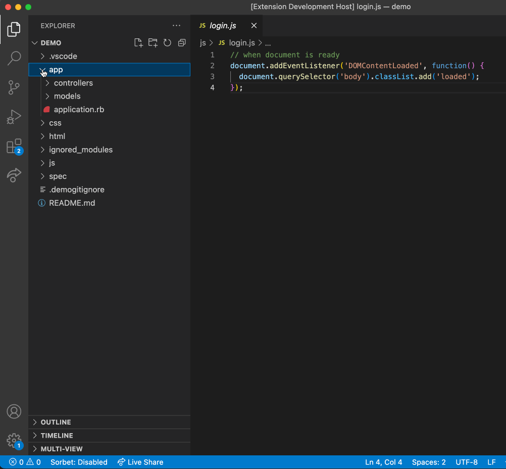

# MultiView

This VS Code extension allows you to remap the files in your codebase, and show an alternative view without having to physically move the files. This can be useful to componentize your layered code, flatten your components to see all similar files in one place, hide files, and more.

## Features

- Configure MultiView with pairs of regular expressions and replacement strings. 
- Save multiple views and name them.
- Each view can apply multiple consecutive replacements.



<!-- TODO: add examples here -->


## Extension Settings

Include if your extension adds any VS Code settings through the `contributes.configuration` extension point.

For example:

This extension contributes the following settings:

- `multiView.conversions`: Named views with regular expression replacements to convert one file system "schema" to another. (See examples below)
- `multiView.ignorePath`: Relative path to a file containing a list of files to ignore. Should follow the same format as `.gitignore` files.


```js
// Expected format
"multiView.conversions": {
  "<categoryName>": [["<regex1>", "<replacement1>"], ["<regex2>", "<replacement2>"], ...],
  "<otherCategoryName>": [...]
}
// Example
"multiView.conversions": {
  // Moves specs from the spec folder to the app folder
  "adjacentSpecs": [["spec/(.*)", "app/$1"]],
  // Creates a folder for each html page with the matching css and js files
  "componentize": [
    ["html/(.*)\\.html", "components/$1/$1.html"],
    ["css/(.*)\\.css", "components/$1/$1.css"],
    ["js/(.*)\\.js", "components/$1/$1.js"]
  ]
}
```


## Known Issues

- Selecting a category is done using a QuickPick until we can create a dynamic menu
- Only one gitignore file can be used. Nested gitignore files are ignored.

## Release Notes

### 0.4.0

- Cleaned up README, and added a demonstration gif.

### 0.3.0

- A gitignore file can be specified to ignore files and folders from the output

### 0.2.0

- Multiple conversion categories are now supported!
- MultiView can now be refreshed
- The category can be selected using quickPick

### 0.1.0

Initial release of MultiView. Only a single conversion is supported.


# Development

## How to build

Run `vsce package`

<!-- TODO: Ensure that you've read through the extensions guidelines and follow the best practices for creating your extension. (https://code.visualstudio.com/api/references/extension-guidelines) -->
